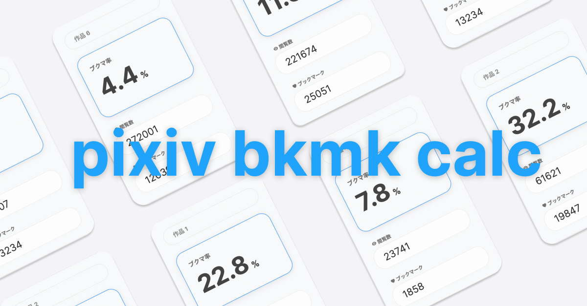

# Pixiv Bookmark Calculator


Simple site to calculate the engagement rate for an artwork on Pixiv.
[Japanese site](https://emhng.github.io/pixiv-bkmk-calc/) || [English site](https://emhng.github.io/pixiv-bkmk-calc/en)

## Running Locally

If you'd like to run the calculator locally, please replace next.config.js with the following:

```javascript
/** @type {import('next').NextConfig} */
const nextConfig = {
  reactStrictMode: true,
  swcMinify: true
}

module.exports = nextConfig
```

Then run the following command:

```javascript
npm run dev
```

The site should now be accessible from localhost:3000
